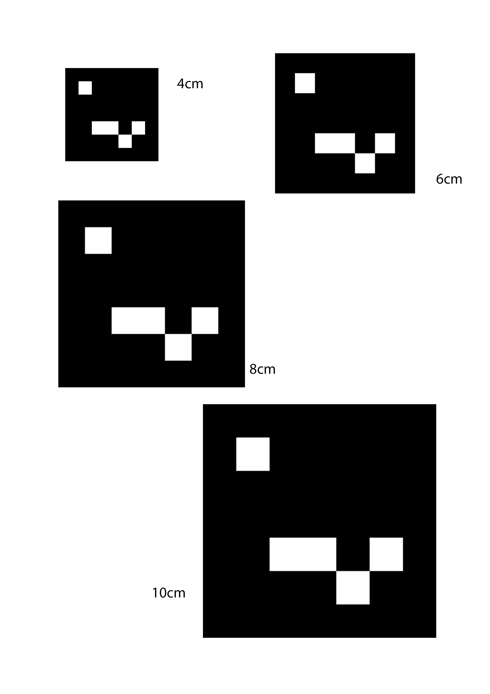

Demo1 vision specific feedback:
- Give details. In general, present how you tested something, and the results. The how includes describing the choice of most relevant metric and procedure (e.g. hit rate, repeating 15x for each setting), as well as the actual set up (e.g. using the ceiling camera 3.5m above the floor, AR tags 5x5cm 10cm above the floor), and also why this set up is relevant (e.g. the AR tags were about as high above the floor as they would be if placed on a prototype table in the future). Then the results are also not just the numbers themselves, but also some comments on whether that means that the system is reliable/accurate enough, etc.

Tested 4x4, 6x6, 8x8, and 10x10 cm AR markers in 3.11, with the markers a on the floor. Placed the markers in different areas of the platform and found that the markers need to bigger than 10x10 cm for it to work reliably.
 

Demo 2 test 1 static recognition:
place marker on every section (with random orientation) of the 3.11 area, measure the amount of frames
it takes to recognize the marker and how long does it take
frame, avg seconds
1,0.06
1,0.06
1,0.07
1,0.22 - outlier
1,0.09
1,0.06
1,0.07
1,0.06
1,0.07
1,0.06
1,0.07
1,0.07
1,0.16 - outlier
1,0.06
1,0.07
1,0.07
1,0.05
1,0.07
1,0.06
1,0.06

20 * 3 = 60 trials

