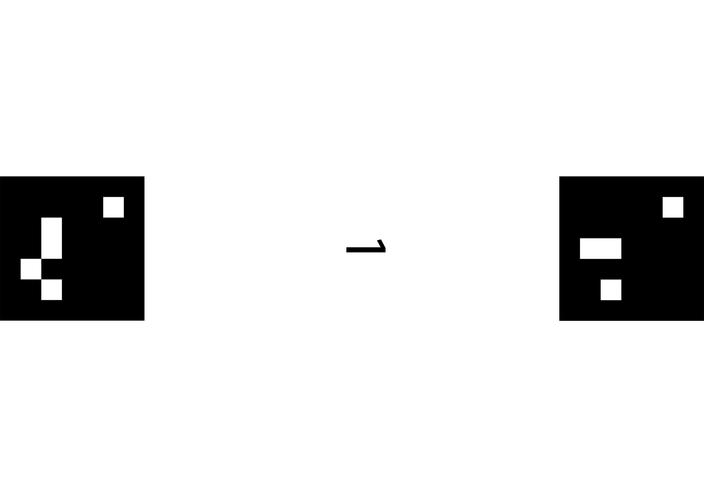
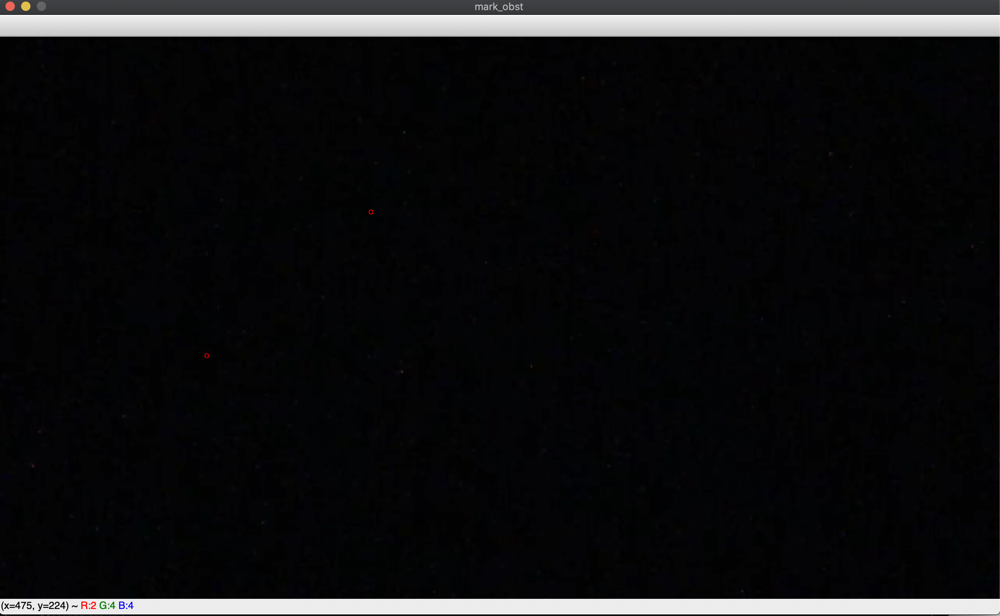
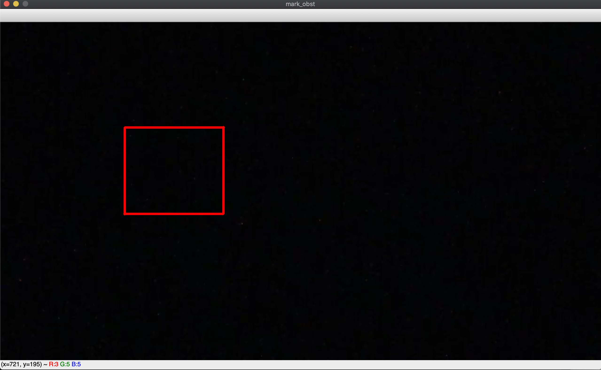

The vision sub-system consists of 3 modules:

 - generate_marker.py
 - camera.py
 - room.py


## generate_marker.py

The module is used to generate AR markers  (<a href="https://github.com/DebVortex/python-ar-markers" target="_blank">ar-markers GitHub</a>) and should be self explanatory to use.


## camera.py 
The module is the main module that carries out the recognition. There are a few pre-requisites you
need to ensure before using this module:

1. The AR markers are placed on a rectangular surface according to specification and are of suitable size.
Two markers should be placed on each surface like so:

The left marker has ID 1 and the right marker has ID 2. The whole surface is identified with the ID of
the left marker, i.e. ID 1. The left marker ID should always be odd and the corresponding right marker
should have an ID value 1 more than the left.
A suitable size is hard to define, but in 3.11, the size of each marker should be more than 10cm x 10cm.

2. The video capturing device is properly installed, i.e. it recognizes the desired area with enough
resolution. The camera in the SDP arena is 1080p and works well.

To use the Camera class, instantiate with an interface number (an int) that is usually 0 or 1.
DO NOT INSTANTIATE A NEW INSTANCE EVERY TIME WHEN REQUESTING POSITIONS.
This means instantiation should happen in a suitable scope and repeated position requests should
happen inside the scope.

Use the **get_pos(num_of_surfaces)** to get the position of all surfaces. Very importantly, you need to specify
how many surfaces there are by passing the num_of_surfaces argument. get_pos() returns a dictionray with the keys being the surface IDs and values being a pair of coordinates specifying the left and right coordinates of
the surface.

Despite the exception handling mechanism implemented, two exceptions can still bee raised if things go really wrong, **MarkerRecognitionFailure** and **KeyError**. When these two exceptions are raised, check the camera connection and check that no surfaces is outside the capturing area.

Below is an example use case with two surfaces to be recognized:
```
c = Camera(1)
pos = c.get_pos(2)
print(pos)
c.release()
```
 The output looks like:
 ```
 Vision: start markers recognition.
{3: ((555, 674), (999, 611)), 1: ((397, 861), (163, 484))}
```

## room.py
This module has several drawing functionalities. It can be intialized in two ways:

 - The first takes a picture of the room using the camera, then you will need to manually mark any obstacles with the mouse.
 - The second loads in a picture of the room and a serialized obstacle object. 

In this document, we will focus on how to initialize a room the first way and how 'drawing obstacles with the mouse' works. 

To initilize an object, do:
```
r = Room(0)         
```
A frame will be taken using the camera, and a pop-up canvas will occur. E.g.

Remember that obstacles are represented using polygons, you will need to mark all the vertices of the polygon by **Double-Clicking the Left Mouse Button** (every time you double-click, a red circle will appear):

Press 'n' (stands for 'new') when you are finished with marking an obstacle, the edges of the polygon you just marked will appear, and you can start marking your next obstacle:

Once you are done marking, press 'q' to quit. 

The obstacles are stored in a dictionary:
```
 obstacle ID: List of vertices
{0: [[x, y], ..., [   ]],
 1: [[    ], ..., [   ]],
 .......................,
 n: [[    ], ..., [   ]]}
```

You can:

 - use  **show()** to show the frame captured with or without obstacles
 - use **serialize()** to serialize the frame and the obstacle dictionary
 - use **draw_path** to draw a path from vertices

See the module for more details.

